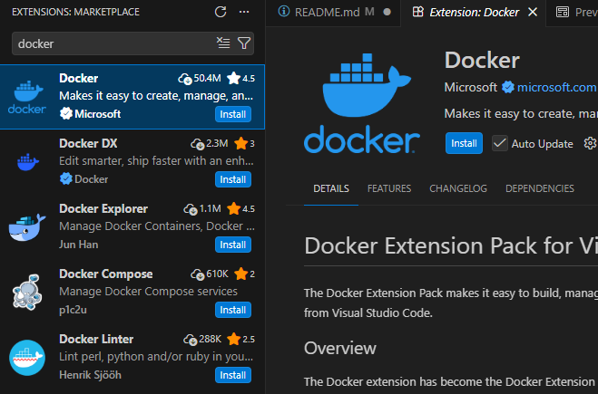
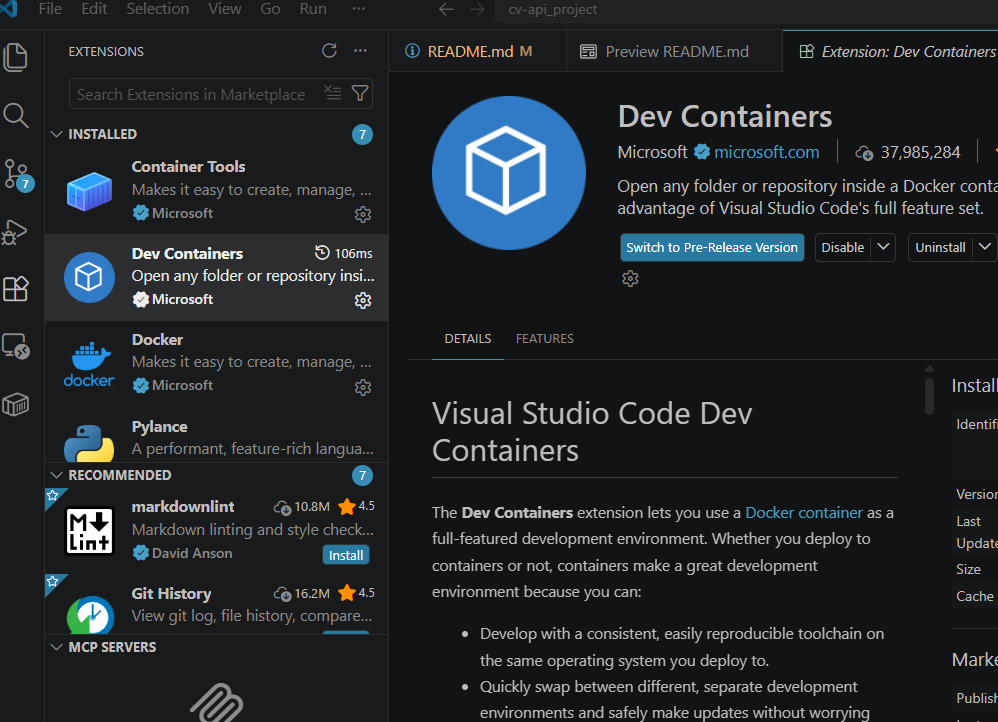
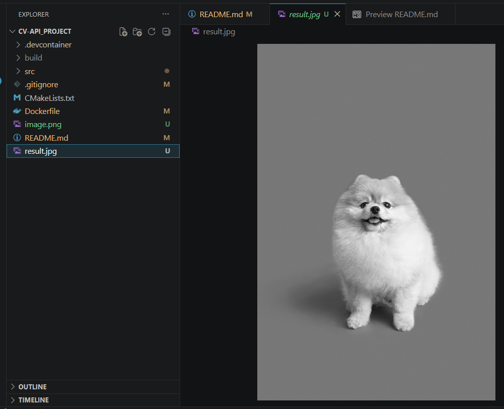
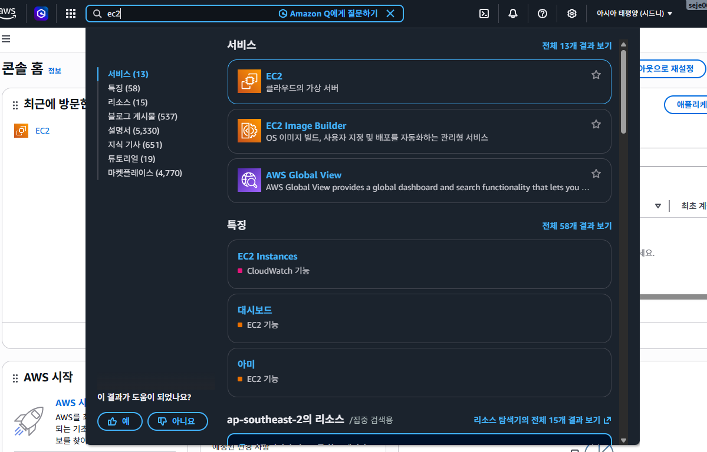
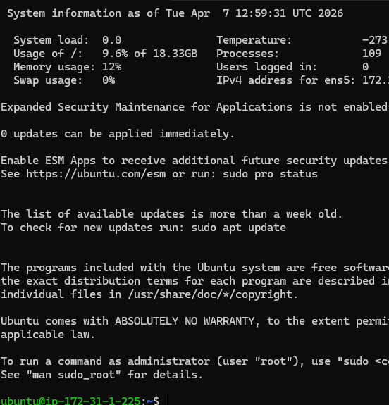
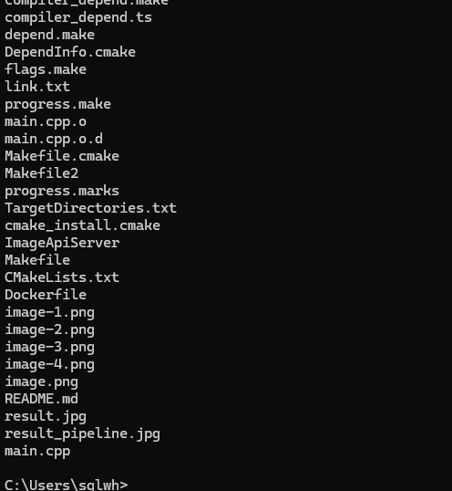

# cv-api_project
개발자가 이미지 링크로 서버에 요청하여 처리할 수 있는 api 개발 프로젝트


## 세팅(로컬)

- 확장에서 Docker 다운

    

- 확장에서 Dev Containers 다운

    

- 컨테이너와 vscode연결 됐으면 필요한 라이브러리 다운과 cmake파일 작성 - [cmake](CMakeLists.txt)

## 빌드 및 테스트(로컬)

- bash 에서 아래 명령문 하나씩 치기
    - 빌드
        ```bash
        > cmake -S . -B build
        > cmake --build build -j
        ```
    - 서버 실행
        ```bash
        > ./build/ImageApiServer
        ```

- 새로 bash 열어서 아래 명령문 치기
    - 서버 열렸는지 확인
        ```bash
        curl http://localhost:8080/health
        ```
    - 이미지 링크 넘겨주고 처리된거 받기
        ```bash
        curl -X POST http://localhost:8080/api/v1/process \
        -H "Content-Type: application/json" \
        -d '{
            "image_url": "https://image.utoimage.com/preview/cp872722/2022/12/202212008462_500.jpg",
            "action": "grayscale"
        }' \
        --output result.jpg
        ```
    
- 처리 결과(흑백 요청)

    


## aws에 배포하기

1. 계정생성 및 인스턴스 생성
    - https://aws.amazon.com/ko/console/ 에서 계정 생성
    - 상단에 EC2 검색 후 들어가서 인스턴스 시작 누르기
    - 주의 : 인스턴스 생성후에 pem파일을 잘 보관해야함 서버 실행할 키라 볼수있음(RSA로 할 경우)

        

2. 가상OS 접속
    - 윈도우 파워쉘 접속 후 pem파일 경로와 설정한os@알려준ip를 실행
    - 참고로 pem파일의 경로는 최소 사용자 아래에 있는게 낫다. 이유는 권한이 너무 열려 있으면 못하게 막아놨다
        ```powershell
        ssh -i "D:\CecurityInfomation\aws_cv-api-key.pem" ubuntu@(인스턴스에서알려주는 공용 ip. 괄호는 빼고)
        ```
    - 성공시 아래와 유사하게 나온다
    
        

3. 가상OS 에서 패키지 설치
    - 필요한 패키지를 연결된 가상OS 에 추가해준다(cmake)
        ```bash
        sudo apt update
        sudo apt upgrade -y
        sudo apt install -y build-essential cmake git pkg-config
        sudo apt install -y libopencv-dev
        sudo apt install -y libcurl4-openssl-dev
        sudo apt install -y nlohmann-json3-dev
        sudo apt install -y libcpp-httplib-dev
        ```

4. 파일,폴더 인스턴스에 올리기
    - 가상OS에 연결된 터미널 냅두고 새로 하나열어서 한다.
        ``` powershell
        scp -i "pem키경로" -r "로컬프로젝트폴더경로" ubuntu@ec2공인ip:/home/ubuntu/
        ```
    - 위처럼 파일이 올라가는데, 자세히보면 리드미파일과 이미지까지 같이 올라갔다(얼마 안되니 무시)

        

5. 빌드
    - 가상OS에 연결된 터미널 가서 아래처럼 작성
        ```bash
        cd /home/ubuntu/cv_api_project
        rm -rf build
        mkdir -p build
        cd build
        cmake ..
        make -j$(nproc)
        ```
6. 서버 실행
    - 실제로 aws가상OS에서 서버를 실행.
        ```bash
        cd /home/ubuntu/cv-api_project/build
        ./ImageApiServer
        ```

7. 서버 계속 돌리기(서비스)
    - 서비스 파일 만들기
        ```bash
        sudo nano /etc/systemd/system/cv-api.service
        ```
    - 파일작성이 열리면 아래문을 작성한다
        ```text
        [Unit]
        Description=C++ CV API Server
        After=network.target

        [Service]
        User=ubuntu
        Group=ubuntu
        WorkingDirectory=/home/ubuntu/cv-api_project/build
        ExecStart=/home/ubuntu/cv-api_project/build/ImageApiServer
        Restart=always
        RestartSec=3

        [Install]
        WantedBy=multi-user.target
        ```
    - systemd에 반영
        ```bash
        sudo systemctl daemon-reload
        ```
    - 부팅시 자동 시작 등록
        ```bash
        sudo systemctl enable cv-api
        ```
    - 서비스 시작. 중지는 stop으로 해주면 된다. 재시작(restart)
        ```bash
        sudo systemctl start cv-api
        ```
    - 상태확인
        ```bash
        sudo systemctl status cv-api
        ```
    - 실시간 로그보기
        ```bash
        journalctl -u cv-api -f
        ```